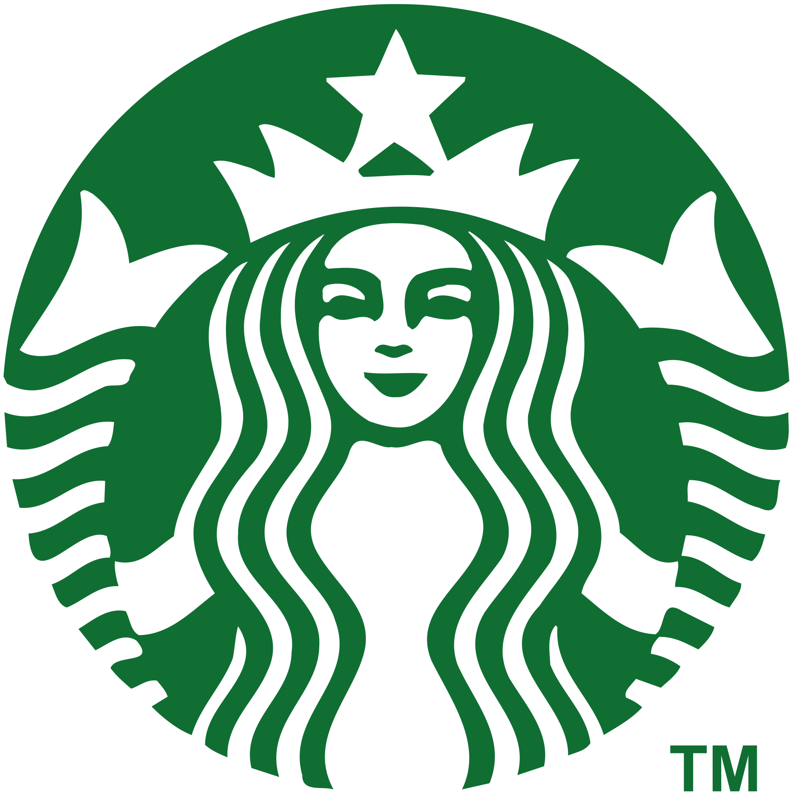

### PT-BR

<h1 align="center">
    
    Starbucks Clone
</h1>

Clone do site Starbucks criado para praticar técnicas modernas de desenvolvimento front-end. O objetivo do projeto foi aprimorar habilidades em React, Tailwind, estrutura de componentes, design responsivo e reprodução fiel da interface com base no layout real.

## 🚀 Tecnologias Utilizadas

- ✅ **React + Vite** — Estrutura leve e rápida para desenvolvimento
- ✅ **TypeScript** — Tipagem segura e escalável
- ✅ **Tailwind CSS** — Estilização com classes utilitárias e responsividade mobile-first
- ✅ **React Router** — Navegação fluida entre páginas
- ✅ **Netlify** — Deploy contínuo e hospedagem do projeto

## 🔗 Links

- [🎥 Acesse o site](https://star-bucks-coffee.netlify.app/)
- [💼 LinkedIn](https://www.linkedin.com/in/mateus-lima-036790184/)

## 📦 Como Instalar e Rodar Localmente

**Clone o repositório:** git clone https://github.com/mts-ml/starbucks-clone 

**Acesse a pasta do projeto:** cd starbucks-clone

**Instale as dependências:** yarn ou npm install dependendo do gerenciador de pacotes

**Inicie o servidor de desenvolvimento:** yarn dev ou npm run dev

## 📝 Créditos

Clone baseado no design original do site Starbucks. Projeto sem fins comerciais.

   

### EN

<h1 align="center">
    
    Starbucks Clone
</h1>

Clone of the Starbucks website built to practice modern front-end development techniques. The project aimed to enhance skills in React, Tailwind, component structure, responsive design, and faithful reproduction of the interface based on the real-world layout.

## 🚀 Technologies Used

- ✅ React + Vite — Lightweight and fast development framework
- ✅ TypeScript — Secure and scalable typing
- ✅ Tailwind CSS — Utility-first styling and mobile-first responsive design
- ✅ React Router — Smooth navigation between pages
- ✅ Netlify — Hosting and continuous deployment

## 🔗 Links

- [🎥 Access the site](https://star-bucks-coffee.netlify.app/)
- [💼 LinkedIn](https://www.linkedin.com/in/mateus-lima-036790184/)

## 📦 How to Install and Run Locally

**Clone the repository:** git clone https://github.com/mts-ml/movies 

**Go to the project folder:** cd starbucks-clone

**Install the dependencies:** yarn or npm install, depending on your package manager

**Start the development server:** yarn dev or npm run dev

## 📝 Credits

This project is a clone based on the official Starbucks website design. Built for educational and portfolio purposes only — no commercial use.
